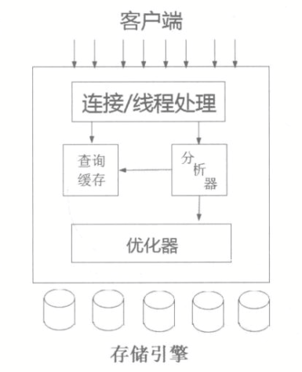

#MySQL 存储引擎

​		如何保证数据并发访问的一致性和有效性是所有数据库必须解决的一个问题。另外，锁冲突也是影响数据库并发性能的一个重要因素。应用程序在选择锁类型时，需要根据实际运行的需要选择最佳的锁类型。

##MySQL 架构

​		MySQL 服务器由 SQL 层和存储引擎层构成。SQL 层的主要功能包括权限判断、SQL 解析功能和查询缓存处理等，存储引擎层（Storage Engine Layer）完成底层数据库数据存储操作。MySQL 整体架构的 SQL 层和存储引擎层实际上各自都包含了很多小模块

​		**图：MySQL 各个模块的工作方式**

