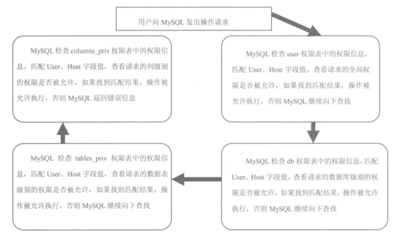

#MySQL 权限于安全管理

​		MySQL 是一个多用户数据库，具有功能强大的访问控制系统，可以为不同用户指定允许的权限。 MySQL 用户可以分为普通用户和 root 用户。root 用户是超级管理员，拥有所有权限，包括创建用户、删除用户和修改用户的密码等管理权限；普通用户只拥有被授予的各种权限。用户管理包括管理用户账户、权限等。

##权限表

​		MySQL 服务器通过权限表来控制用户对数据库的访问，权限表存放在 MySQL 数据库中，由MySQL_install_db 脚本初始化。存储账户权限信息的表主要有 user、db、host、tables_priv、columns_priv 和 procs_priv。

###user 表

​		user 表是 MySQL 中最重要的一个权限表，记录允许连接到服务器的账号信息，里面的权限是全局级的。例如，一个用户在 user 表中被授予了 DELETE 权限，则该用户可以删除 MySQL 服务器上所有数据库中的任何记录。MySQL 8.0 中 user 表有42个字段，这些字段可以分为 4 类，分别是用户列、权限列、安全列和资源控制列。

​		**表：user 表结构**

| 字段名                 | 数据类型                             | 默认值 |
| ---------------------- | ------------------------------------ | ------ |
| Host                   | CHAR(60)                             |        |
| User                   | CHAR(16)                             |        |
| authentication_string  | TEXT                                 |        |
| Select_priv            | ENUM('N', 'Y')                       | N      |
| Insert_priv            | ENUM('N', 'Y')                       | N      |
| Update_priv            | ENUM('N', 'Y')                       | N      |
| Delete_priv            | ENUM('N', 'Y')                       | N      |
| Create_priv            | ENUM('N', 'Y')                       | N      |
| Drop_priv              | ENUM('N', 'Y')                       | N      |
| Reload_priv            | ENUM('N', 'Y')                       | N      |
| Shutdown_priv          | ENUM('N', 'Y')                       | N      |
| Process_priv           | ENUM('N', 'Y')                       | N      |
| File_priv              | ENUM('N', 'Y')                       | N      |
| Grant_priv             | ENUM('N', 'Y')                       | N      |
| References_priv        | ENUM('N', 'Y')                       | N      |
| Index_priv             | ENUM('N', 'Y')                       | N      |
| After_priv             | ENUM('N', 'Y')                       | N      |
| Show_db_priv           | ENUM('N', 'Y')                       | N      |
| Super_priv             | ENUM('N', 'Y')                       | N      |
| Create_tmp_table_priv  | ENUM('N', 'Y')                       | N      |
| Lock_tables_priv       | ENUM('N', 'Y')                       | N      |
| Execute_priv           | ENUM('N', 'Y')                       | N      |
| Repl_slave_priv        | ENUM('N', 'Y')                       | N      |
| Create_view_priv       | ENUM('N', 'Y')                       | N      |
| Show_view_priv         | ENUM('N', 'Y')                       | N      |
| Create_routine_priv    | ENUM('N', 'Y')                       | N      |
| After_routine_priv     | ENUM('N', 'Y')                       | N      |
| Create_user_priv       | ENUM('N', 'Y')                       | N      |
| Event_priv             | ENUM('N', 'Y')                       | N      |
| Trigger_priv           | ENUM('N', 'Y')                       | N      |
| Create_tablespace_priv | ENUM('N', 'Y')                       | N      |
| ssl_type               | ENUM('', 'ANY', 'X509', 'SPECIFIED') |        |
| ssl_chiper             | blob                                 | NULL   |
| x509_issuer            | blob                                 | NULL   |
| x509_subject           | blob                                 | NULL   |
| max_questions          | INT(11) UNSIGNED                     | 0      |
| max_updates            | INT(11) UNSIGNED                     | 0      |
| max_connections        | INT(11) UNSIGNED                     | 0      |
| max_user_connections   | INT(11) UNSIGNED                     | 0      |
| plugin                 | CHAR(64)                             |        |
| authentication_string  | TEXT                                 | NULL   |

- **用户列**：user 表的用户列包括 Host、User、authentication_string，分别表示主机名、用户名和密码。其中 User 和 Host 为 User 表的联合主键。当用户与服务器之间建立连接时，输入的账户信息中的用户名称、主机名和密码必须匹配 User 表中对应的字段，只有 3 个值都匹配的时候，才允许连接的建立。这 3 个字段的值就是创建账户时保存的账户信息。修改用户密码时，实际就是修改 user 表的 authentication_string 字段的值。

- **权限列**：权限列的字段决定了用户的权限，描述了在全局范围内允许对数据和数据库进行的操作。包括查询权限、修改权限等普通权限，还包括了关闭服务器、超级权限和加载用户等高级权限。普通权限用于操作数据库;高级权限用于数据库管理。

  user 表中对应的权限是针对所有用户数据库的。这些字段值的类型为 ENUM，可以取的值只能为 Y 和 N，Y 表示该用户有对应的权限；N 表示用户没有对应的权限。查看 user 表的结构可以看到，这些字段的值默认都是 N。如果要修改权限，可以使用 GRANT 语句或 UPDATE 语句更改 user 表的这些字段来修改用户对应的权限。

- **安全列**：安全列只有 6 个字段，其中两个是 ssl 相关的，两个是 x509 相关的，另外两个是授权插件相关的。ssl 用于加密；x509 标准可用于标识用户；Plugin 字段标识可以用于验证用户身份的插件，如果该字段为空，服务器使用内建授权验证机制验证用户身份。读者可以通过 SHOW  VARIABLES LIKE have_openssl' 语句来查询服务器是否支持 ssl 功能。

- **资源控制列**：资源控制列的字段用来限制用户使用的资源，包含 4 个字段，分别为

  - max_questions 用户每小时允许执行的查询操作次数。
  - max_updates 用户每小时允许执行的更新操作次数。
  - max_connections 用户每小时允许执行的连接操作次数。
  - max_user_connections 用户允许同时建立的连接次数。

  一个小时内用户查询或者连接数量超过资源控制限制，用户将被锁定，直到下一个小时，才可以在此执行对应的操作。可以使用 GRANT 语句更新这些字段的值。

###db 表

​		db 表是 MySQL 数据中非常重要的权限表。db 表中存储了用户对某个数据库的操作权限，决定用户能从哪个主机存取哪个数据库。db 表比较常用。

​		**表：db 表结构**

| 字段名                | 数据类型       | 默认值 |
| --------------------- | -------------- | ------ |
| Host                  | CHAR(60)       |        |
| Db                    | CHAR(64)       |        |
| User                  | CHAR(32)       |        |
| Select_priv           | ENUM('N', 'Y') | N      |
| Insert_priv           | ENUM('N', 'Y') | N      |
| Update_priv           | ENUM('N', 'Y') | N      |
| Delete_priv           | ENUM('N', 'Y') | N      |
| Create_priv           | ENUM('N', 'Y') | N      |
| Drop_priv             | ENUM('N', 'Y') | N      |
| Grant_priv            | ENUM('N', 'Y') | N      |
| References_priv       | ENUM('N', 'Y') | N      |
| Index_priv            | ENUM('N', 'Y') | N      |
| After_priv            | ENUM('N', 'Y') | N      |
| Create_tmp_table_priv | ENUM('N', 'Y') | N      |
| Lock_tables_priv      | ENUM('N', 'Y') | N      |
| Create_view_priv      | ENUM('N', 'Y') | N      |
| Show_view_priv        | ENUM('N', 'Y') | N      |
| Create_routine_priv   | ENUM('N', 'Y') | N      |
| After_routine_priv    | ENUM('N', 'Y') | N      |
| Execute_priv          | ENUM('N', 'Y') | N      |
| Trigger_priv          | ENUM('N', 'Y') | N      |

- **用户列**：db 表用户列有 3 个字段，分别是 Host、User、Db，标识从某个主机连接某个用户对某个数据库的操作权限，这 3 个字段的组合构成了 db 表的主键。host 表不存储用户名称，用户列只有 2 个字段，分别是 Host 和 Db，表示从某个主机连接的用户对某个数据库的操作权限，其主键包括 Host 和 Db 两个字段。host 很少用到，一般情况下 db 表就可以满足权限控制需求了。
- **权限列**：db 表中 create_routine_priv 和 alter_routine_priv 这两个字段表明用户是否有创建和修改存储过程的权限。

​		user 表中的权限是针对所有数据库的，如果希望用户只对某个数据库有操作权限，那么需要将 user 表中对应的权限设置为 N，然后在 db 表中设置对应数据库的操作权限。例如，有一个名称为 Zhangting 的用户分别从名称为 large.domain.com 和 small.domain.com 的两个主机连接到数据库，并需要操作 books 数据库。这时，可以将用户名称 Zhangting 添加到 db 表中，而 db 表中的 host 字段值为空，然后将两个主机地址分别作为两条记录的 host 字段值添加到 host 表中，并将两个表的数据库字段设置为相同的值 books。当有用户连接到 MySQL 服务器时，db 表中没有用户登录的主机名称，则 MySQL 会从 host 表中查找相匹配的值，并根据查询的结果决定用户的操作是否被允许。

###tables_priv 表和 columns_priv 表

​		tables_priv 表用来对表设置操作权限，columns_priv 表用来对表的某一列设置权限。

​		**表：tables_priv 表结构**

| 字段名      | 数据类型                                                     | 默认值            |
| ----------- | ------------------------------------------------------------ | ----------------- |
| Host        | CHAR(60)                                                     |                   |
| Db          | CHAR(64)                                                     |                   |
| User        | CHAR(16)                                                     |                   |
| Table_name  | CHAR(64)                                                     |                   |
| Grantor     | CHAR(77)                                                     |                   |
| Timestamp   | TIMESTAMP                                                    | CURRENT_TIMESTAMP |
| Table_priv  | SET('Slect', 'Insert', 'Update', 'Delete', 'Create', 'Drop', 'Grant', 'References', 'Index', 'Alter', 'Create View', 'Show view', 'Trigger') |                   |
| Column_priv | SET('Select', 'Insert', 'Update', 'References')              |                   |

- Host、Db、User 和 Table_name 4 个字段分表示主机名、数据库名、用户名和表名
- Grantor 表示修改该记录的用户。
- Timestamp 字段表示修改该记录的时间。
- Table_priv 表示对表的操权，包括 Select、Insert、Update、Delete、Create、Drop、Grant、References、Index 和 Alter
- Column_priv 字段表示对表中的列的操作权限，包括 Select、Insert、Update 和 References。

​		**表：columns_priv 表结构**

| 字段名      | 数据类型                                        | 默认值            |
| ----------- | ----------------------------------------------- | ----------------- |
| Host        | CHAR(60)                                        |                   |
| Db          | CHAR(64)                                        |                   |
| User        | CHAR(16)                                        |                   |
| Table_name  | CHAR(64)                                        |                   |
| Column_name | CHAR(64)                                        |                   |
| Timestamp   | TIMESTAMP                                       | CURRENT_TIMESTAMP |
| Column_priv | SET('Select', 'Insert', 'Update', 'References') |                   |

- Column_name 用来指定对哪些数据列具有操作权限。

###procs_priv 表

​		procs_priv 表可以对存储过程和存储函数设置操作权限。

​		**表：procs_priv 表结构**

| 字段名       | 数据类型                                 | 默认值            |
| ------------ | ---------------------------------------- | ----------------- |
| Host         | CHAR(60)                                 |                   |
| Db           | CHAR(64)                                 |                   |
| User         | CHAR(16)                                 |                   |
| Routine_name | CHAR(64)                                 |                   |
| Routine_type | ENUM('FUNCTION', 'PROCEDURE')            | NULL              |
| Grantor      | CHAR(77)                                 |                   |
| Proc_priv    | SET('Execute', 'Alter Routine', 'Grant') |                   |
| Timestamp    | TIMESTAMP                                | CURRENT_TIMESTAMP |

- Host、Db 和 User 字段分别表示主机名、数据库名和用户名。Routine_name 表示存储过程或函数的名称。
- Routine_type 表示存储过程或函数的类型。Routine_type 字段有两个值，分别是 FUNCTION 和 PROCEDURE；FUNCTION 表示这是一个函数，PROCEDURE 表示这是一个存储过程。
- Grantor 是插入或修改该记录的用户。
- Proc_priv 表示拥有的权，包括 Execute、Alter Routine、Grant 3 种。
- Timestamp 表示记录更新时间。

##账户管理

​		MySQL 提供了许多语句来管理用户账号，包括登录和退出 MySQL 服务器、创建用户、删除用户、密码管理和权限管理等内容。MySQL 数据库的安全性需要通过账户管理来保证。

###登录和退出 MySQL 服务器

​		通过 MySQL --help 命令可以查看MySQL命令帮助信息。MySQL 命令的常用参数如下

- -h主机名，可以使用该参数指定主机名或 ip，如果不指定，默认是 localhost。
- -u用户名，可以使用该参数指定用户名。
- -p密码，可以使用该参数指定登录密码。如果该参数后面有一段字段，则该段字符串将作为用户的密码直接登录。如果后面没有内容，则登录的时候会提示输入密码。注意：该参数后面的字符串和 -p 之前不能有空格。
- -P端口号，该参数后面接 MySQL 服务器的端口号，默认为 3306。
- 数据库名，可以在命令的最后指定数据库名。
- -e执行 SQL 语句。如果指定了该参数，将在登录后执行-e 后面的命令或 SQL 语句并退出。

​		使用 root 用户登录到本地 MySQL 服务器的 mysql 库中

```
mysql -h localhost -u root -p mysql
```

​		使用 root 用户登录到本地 MySOL 服务器的 testdb 数据库中，同时执行一条查询语句

```
MySQL -h localhost -u root -p test_db -e "DESC person;"
```

###新建普通用户

​		创建新用户，必须有相应的权限来执行创建操作。在 MySQL 数据库中，有两种方式创建新用户：一种是使用 CREATE USER 语句；另一种是直接操作 MySQL 授权表。

####使用 CREATE USER 语句创建新用户

​		执行 CREATE USER 或 GRANT 语句时，服务器会修改相应的用户授权表，添加或者修改用户及其权限。CREATE USER 语句的基本语法格式如下

```
CREATE USER user_specification [, user_specification] ...

user_specification:
    user@host
    [
        IDENTIFIED BY [PASSWORD] 'password' | INDENFIED WITH auth_plugin [AS 'auth_string']
    ]
```

user 表示创建的用户的名称；host 表示允许登录的用户主机名称；IDENTIFIED BY 表示用来设置用户的密码；[PASSWORD] 表示使用哈希值设置密码，该参数可选；'password' 表示用户登录时使用的普通明文密码；IDENTIFIED WITH 语句为用户指定一个身份验证插件；auth_plugin 是插件的名称，插件的名称可以是一个带单引号的字符串或者带双引号的字符串；auth_string 是可选的字符串参数，该参数将传递给身份验证插件，由该插件解释该参数的意义。

​		CREATE USER 语句会添加一个新的 MySQL 账户。使用 CREATE USER 语句用户，必须有全局的 CREATE USER 权限或 MySQL 数据库的 INSERT 权限。每添加一个用户，CREATE USER 语句会在MySQL.user 表中添加一条新记录，但是新创建的账户没有任何权限。如果添加的账户己经存在，CREATE USER 语句会返回一个错误

```sql
CREATE USER 'jeffrey'@'localhost' IDENTIFIED BY 'mypass';
```

如果只指定用户名部分 'jeffrey'，主机名部分则默认为 % （对所有的主机开放权限）

​		user_specification 告诉 MySQL 服务器当用户登录时怎么验证用户的登录授权。如果指定用登录不需要密码，可以省略 IDENTIFIED BY 部分

```sql
CREATE USER 'jeffery'@'localhost';
```

此种情况，MySQL 服务端使用内建的身份验证机制，用户登录时不能指定密码。如果要创建指定密码的用户，需要 IDENTIFIED BY 指定明文密码值

```sql
CREATE USER 'jeffery'@'localhost' IDENTIFIED BY 'mypass';
```

此种情况，MySQL 服务端使用内建的身份验证机制，用户登录时必须指定密码。

​		MySQL 的某些版本中会引入授权表的结构变化，添加新的特权或功能。每当更新 MySQL 到个新的版本时，应该更新授权表，以确保它们有最新的结构，确认可以使用任何新功能。

####直接操作 MySQL 用户表

​		通过前面的介绍，使用 CREATE USER 创建新用户时，实际上都是在 user 表中添加一条新的记录。因此，可以使用 INSERT 语句向 user 表中直接插入一条记录来创建一个新的用户。使用 INSERT 语句，必须拥有对 MySQL.user 表的 INSERT 权限。使用 INSERT 语句创建新用户的基本语法格式如下

```
INSERT INTO MySQL.user(Host, User, authentication_string) VALUES ('host', 'username', MD5('password'));
```

Host、User、authentication_string 分别为 user 表中的主机、用户名称和密码字段；MD5() 函数
为密码加密函数。

```sql
use mysql;
```

```sql
INSERT INTO MySQL.user(Host, User, authentication_string) VALUES ('localhost', 'customer1', MD5('aa123456'));
```

> ​		报错
>
> ```
> INSERT INTO MySQL.user(Host, User, authentication_string) VALUES ('localhost', 'customer1', MD5('aa123456'));
> ERROR 1364 (HY000): Field 'ssl_cipher' doesn't have a default value
> ```
>
> ```sql
> SHOW WARNINGS;
> ```
>
> ```
> mysql> SHOW WARNINGS;
> +---------+------+--------------------------------------------------------------------------------------+
> | Level   | Code | Message                                                                              |
> +---------+------+--------------------------------------------------------------------------------------+
> | Warning | 1287 | 'MD5' is deprecated and will be removed in a future release. Please use SHA2 instead |
> | Error   | 1364 | Field 'ssl_cipher' doesn't have a default value                                      |
> | Error   | 1364 | Field 'x509_issuer' doesn't have a default value                                     |
> | Error   | 1364 | Field 'x509_subject' doesn't have a default value                                    |
> +---------+------+--------------------------------------------------------------------------------------+
> ```
>
> 因为 ssl_cipher、x509_issuer 和 x509_subject 3 个字段在 user 表定义中没有设置默认值，所以在这里提示错误信息，影响 INSERT 语句的执行。使用 SELECT 语句查看 user 表中的记录
>
> ```
> SELECT host, user, authentication_string FROM user;
> ```
>
> ```
> mysql> SELECT host, user, authentication_string FROM user;
> +-----------+------------------+------------------------------------------------------------------------+
> | host      | user             | authentication_string                                                  |
> +-----------+------------------+------------------------------------------------------------------------+
> | localhost | mysql.infoschema | $A$005$THISISACOMBINATIONOFINVALIDSALTANDPASSWORDTHATMUSTNEVERBRBEUSED |
> | localhost | mysql.session    | $A$005$THISISACOMBINATIONOFINVALIDSALTANDPASSWORDTHATMUSTNEVERBRBEUSED |
> | localhost | mysql.sys        | $A$005$THISISACOMBINATIONOFINVALIDSALTANDPASSWORDTHATMUSTNEVERBRBEUSED |
> | localhost | root             | $A$005$<T# [a4[84[CW(sIgA6wNVzamzg33AYeDCJgz4MJ6MLwkdcuqZQ5dCvp1 |
> +-----------+------------------+------------------------------------------------------------------------+
> ```
>
> 可以看到新用户 customer1 并没有添加到 user 表中，表示添加新用户失败。

###删除普通用户

​		在 MySQL 数据库中，可以使用 DROP USER 语句删除用户，也可以直接通过 DELETE 从MySQL.user 表中删除对应的记录来删除用户。

####使用 DROP USER 语句删除用户

```
DROP USER user [, user];
```

DROP USER 语句用于删除一个或多个 MySQL 账户。要使用 DROP USER，必须拥有 MySQL 数据库的全局 CREATE USER 权限或 DELETE 权限。使用与 GRANT 或 REVOKE 相同的格式为每个账户命名。例如，'jeffirey'@'localhost' 账户名称的用户和主机部分与用户表记录的 User 和 Host 列值相对应

```sql
DROP USER 'user'@'localhost';
```

```sql
DROP USER;
```

第 1 条语句可以删除 user 在本地登录权限；第 2 条语句可以删除来自所有授权表的账户权限记录。

```sql
DROP USER 'jeffrey'@'localhost';
```

​		DROP USER 不能自动关闭任何打开的用户对话。而且，如果用户有打开的对话，此时取消用户，命令则不会生效，直到用户对话被关闭后才能生效。一旦对话被关闭，用户也被取消，此用户再次试图登录时将会失败

####使用 DELETE 语句删除用户

​		DELETE 语句基本语法格式如下

```
DELETE FROM MySQL.user WHERE host='hostname' and 'user'='username'
```

```sql
CREATE USER 'customer1'@'localhost' IDENTIFIED BY 'my123';
```

```sql
DELETE FROM MySQL.user WHERE host='localhost' and user='customer1';
```

###root 用户修改自己的密码

​		root 用户的安全对于保证 MySQL 的安全非常重要，因为 root 用户拥有很高的权限。

​		因为所有账户信息都保存在 user 表中，所以可以通过直接修改 user 表来改变 root 用户的密码。root 用户登录到 MySQL 服务器后，使用 UPDATE 语句修改 MySQL 数据库的 user 表的authentication_string 字段，从而修改用户的密码。使用 UPDATA 语句修改 root 用户密码的语句

```
UPDATE mysql.user set authentication_string=MD5("123456") WHERE User="root" and Host="localhost";
```

PASSWORD() 函数用来加密用户密码。执行 UPDATE 语句后，需要执行 FLUSH PRIVILEGES 语句重新加载用户权限。

###root 用户修改普通用户密码

​		root 用户拥有很高的权限，不仅可以修改自己的密码，还可以修改其他用户的密码。root 用户登录 MySQL 服务器后，可以通过 SET 语句修改 MySQL.user 表、通过 UPDATE 语句修改用户的密码。

```sql
CREATE USER 'user'@'localhost' IDENTIFIED BY 'my123';
```

####使用 SET 语句修改普通用户密码

```sql
SET PASSWORD FOR 'user'@'localhost' = 'sa123';
```

####使用 UPDATE 语句修改普通用户密码

​		使用 root 用户登录到 MySQL 服务器后，可以使用 UPDATE 语句修改 MySQL 数据库的 user 表的 password 字段，从而修改普通用户的密码。使用 UPDATA 语句修改用户密码的语法如下

```
UPDATE MySQL.user SET authentication_string=MD5("123456") WHERE User='username' AND Host='hostanme';
```

MD5() 函数用来加密用户密码。执行 UPDATE 语句后，需要执行 FLUSH PRIVILEGES 语句重新加载用户权限。

```sql
UPDATE MySQL.user SET authentication_string=MD5("sns123") WHERE User='user' AND Host='localhost';
```

##权限管理

​		权限管理主要是对登录到 MySQL 的用户进行权限验证。所有用户的权限都存储在 MySQL 的权限表中，不合理的权限规划会给 MySQL 服务器带来安全隐患。数据库管理员要对所有用户的权限进行合理规划管理。MySQL 权限系统的主要功能是证实连接到一台给定主机的用户，并且赋予该用户在数据库上的 SELECT、INSERT、UPDATE 和 DELETE 权限

###MySQL 的各种权限

​		账户权信息被存储在 MySQL数据库的 user、db、host、tables_priv、columns_priv 和 procs_priv 表中。在 MySQL 启动时，服务器将这些数据库表中权限信息的内容读入内存。

​		GRANT 和 REVOKE 语句所涉及的权限的名称如下表所示，其中还有在授权表中每个权限的表列名称和每个权限有关的操作对象等。

​		**表：GRANT 和 REVOKE 语句中可以使用的权限**

| 权限                    | user 表中对应的列      | 权限的范围           |
| ----------------------- | ---------------------- | -------------------- |
| CREATE                  | Create_priv            | 数据库、表或索引     |
| DROP                    | Drop_priv              | 数据库、表或视图     |
| GRANT OPTION            | Grant_priv             | 数据库、表或存储过程 |
| REFERENCES              | References_priv        | 数据库或表           |
| EVENT                   | Event_priv             | 数据库               |
| ALTER                   | Alter_priv             | 数据库               |
| DELETE                  | Delete_priv            | 表                   |
| INDEX                   | Inde_priv              | 表                   |
| INSERT                  | Insert_priv            | 表                   |
| SELECT                  | Select_priv            | 表或列               |
| UPDATE                  | Update_priv            | 表或列               |
| CREATE TEMPORARY TABLES | Create_tmp_table_priv  | 表                   |
| LOCK TABLES             | Lock_tables_priv       | 表                   |
| TRIGGER                 | Trigger_priv           | 表                   |
| CREATE VIEW             | Create_view_priv       | 视图                 |
| SHOW VIEW               | Show_view_priv         | 视图                 |
| ALTER ROUTINE           | Alter_routine_priv     | 存储过程和函数       |
| CREATE ROUTINE          | Create_routine_priv    | 存储过程和函数       |
| EXECUTE                 | Execute_priv           | 存储过程和函数       |
| FILE                    | File_priv              | 访问服务器上的文件   |
| CREATE TABLESPACE       | Create_tablespace_priv | 服务器管理           |
| CREATE USER             | Create_user_priv       | 服务器管理           |
| PROCESS                 | Process_priv           | 存储过程和函数       |
| RELOAD                  | Reload_priv            | 访问服务器上的文件   |
| REPLICATION CLIENT      | Repl_client_priv       | 服务器管理           |
| REPLICATION SLAVE       | Repl_slave_priv        | 服务器管理           |
| SHOW DATABASES          | Show_db_priv           | 服务器管理           |
| SHUTDOWN                | Shutdown_priv          | 服务器管理           |
| SUPER                   | Super_priv             | 服务器管理           |

- CREATE 和 DROP 权限，可以创建新数据库和表，或删除（移掉）已有数据库和表。如果将 MySQL 数据库中的 DROP 权限授予某用户，用户可以删掉 MySQL 访问权限保存的数据库。
- SELECT、INSERT、UPDATE 和 DELETE 权限允许在一个数据库现有的表上实施操作。
- SELECT 权限只有在它们真正从一个表中检索行时才被用到。
- INDEX 权限允许创建或删除索引，INDEX 适用已有表。如果具有某个表的 CREATE 权限，可以在 CREATE TABLE 语句中包括索引定义。
- ALTER 权限，可以使用 ALTER TABLE 来更改表的结构和重新命名表。
- CREATE ROUTINE 权限用来创建保存的程序（函数和程序），ALTER ROUTINE 权限用来更改和删除保存的程序，EXECUTE 权限用来执行保存的程序。
- GRANT 权限允许授权给其他用户，可用于数据库、表和保存的程序。
- FILE 权限给予用户使用 LOAD DATA INFILE 和 SELECT ... INTO OUTFILE 语句读或写服务器上的文件，任何被授予 FILE 权限的用户都能读或 MySQL 服务器上的任何文件（说明用户可以读任何数据库目录下的文件，因为服务器可以访问这些文件）。FILE 权限允许用户在 MySQL 服务器具有写权限的目录下创建新文件，但不能覆盖已有文件。

​		其的权限用于管理性操作，它使用 MySQLadmin 程序或 SQL 语句实施。下表显示每个权限允许执行的 MySQLadmin 命令

​		**表：不同权限下可以使用的 MySQLadmin 命令**

| 权限     | 权限拥有着允许执行的命令                                     |
| -------- | ------------------------------------------------------------ |
| RELOAD   | flush-hosts、flush-logs、flush-privileges、flush-status、flush-tables、flush-threads、refresh、reload |
| SHUTDOWN | shutdown                                                     |
| PROCESS  | processlist                                                  |
| SUPER    | kill                                                         |

- reload 命令告诉服务器将授权表重新读入内存；flush-privileges 是 reload 的同义词；refresh 命令清空所有表并关闭/打开记录文件；其他 flush-xxx 命令执行类似 refresh 的功能，但是范围更有限，并且在某些情况下可能更好用。例如，如果只是想清空记录文件，flush-logs 是比 refresh 更好的选择。
- shutdown 命令关掉服务器。只能从 MySQLadmin 发出命令。
- processlist 命令显示在服务器内执行的线程的信息（其他账户相关的客户端执行的语句）。kill 命令杀死服务器线程。用户总是能显示或杀死自己的线程，但是需要 PROCESS 权限来显示或杀死其他用户和 SUPER 权限启动的线程。
- kill 命令能用来终止其他用户或更改服务器的操作方式。

​		总的来说，只授予权限给需要它们的那些用户

###授权

​		授权就是为某个用户授予权限。合理的授权可以保证数据库的安全。MySQL 中可以使用 GRANT 语句为用户授予权限。授予的权限可以分为多个层级

- **全局层级**：全局权限适用于一个给定服务器中的所有数据库。这些权限存储在 MySQL.user 表中。`GRANT ALL ON *.*`  和 `REVOKE ALL ON *.*` 只授予和撤销全局权限。
- **数据库层级**：数据库权限适用于一个给定数据库中的所有目标。这些权限存储在 MySQL.db 和 MySQL.host 表中。GRANT ALL ON db_name. 和 REVOKE ALL ON db_name.* 只授予和撤销数据库权限。
- **表层级**：表权限用于一个给定表中的所有列。这些权限存储在 MySQL.talbes_priv 表中。GRANT ALL ON db_name.tbl_name 和 REVOKE ALL ON db_name.tbl_name 只予和撤销表权限。
- **列层级**：列权限适用于一个给定表中的单一列。这些权限存储在 MySQL.columns_priv 表中。当使用 REVOK E时，必须指定与被授权列相同的列。
- **子程序层级**：CREATE ROUTINE、ALTER ROUTINE、EXECUTE 和 GRANT 权用于已存储的子程序.这些权限可以被授予为全局层级和数据库层级。而且，除了CREATE ROUTINE外，这些权限可以被授予子程序层级，并存储在 MySQL.procs_priv 表中。

​		在MySQL中，必须是拥有 GRANT 权限的用户才可以执行 GRANT 语句。要使用 GRANT 或REVOKE，必须拥有 GRANT OPTION 权限，并且必须用于正在授予或撤销的权限

```
GRANT priv_type [(columns)] [, priv_type [(columns)]] ... ON [object_type] table1, table2, ... tablen TO user [WITH GRANT OPTION] object_type=TABLE|FUNCTION|PROCEDURE
```

​		其中，priv_type 参数表示权限类型；columns 参数表示权限作用于哪些列上，不指定该参数，表示作用于整个表；table1, table2 , ..., tablen 表示授予权限的列所在的表；object_type 指定授权作用的对象类型包括 TABLE（表） 、FUNCTION（函数）和 PROCEDURE（存储过程），当从旧版本的 MySQL 升级时，要使用 object_tpye 子句，必须升级授权表；user 参数表示用户账户，由用户名和主机名构成，形式是 'username'@'hostname'；IDENTIFIED BY 参数用于设置密码。WITH 关键字后可以跟一个或多个 with option 参数。这个参数有 5 个选项，意义如下

- GRANT OPTION：被授权的用户可以将这些权限赋予别的用户。
- MAX_QUERIES_PER_HOUR count：设置每个小时可以执行 count 次查询。
- MAX_UPDATES_PER_HOUR count：设置每小时可以执行 count 次更新。
- MAX_CONNECTIONS_PER_HOUR count：设置每小时可以建立 count 个连接.
- MAX_USER_CONNECTIONS count：设置单个用户可以同时建立 count 个连接。

​		使用 GRANT 语句创建一个新的用户 grantUser，密码为 "grantpwd"。用户 grantUser 对所有的数据有查询、插入权限，并授于 GRANT 权限。

```sql
GRANT SELECT, INSERT ON *.* TO 'grantUser'@'localhost' IDENTIFIED BY 'grantpwd' WITH GRANT OPTION;
```

```sql
SELECT Host, User, SELECT_priv, Insert_priv, Grant_priv FROM mysql.user WHERE user='grantUser';
```

###收回权限

​		收回权限就是取消已经赋予用户的某些权限。收回用户不必要的权限可以在一定程度上保证系统的安全性。MySQL 中使用 REVOKE 语句取消用户的某些权限。使用 REVOKE 收回权限之后，用户账户的记录将从 db、host、tables_priv 和 columns_priv 表中删除，但是用户账号记录仍然在 user 表中保存（删除 user 表中的账户记录，使用 DROP USER 语句）。在将用户账户从 user 表删除之前，应该收回相应用户的所有权限。REVOKE 语句有两种语法格式。

​		第一种语法是收回所有用户的所有权限，用于取消对于已命名的用户的所有全局层级、数据库层级、表层级和列层级的权限

```
REVOKE ALL PRIVILEGES, GRANT OPTION FROM 'user'@'host' [, 'user'@'host', ...]
```

REVOKE 语句必须和 FROM 语句一起使用。FROM 语句指明需要收回权限的账户。

​		另一种为长格式的 REVOKE 语句

```
REVOKE priv_type [(columns)] [, priv_type [(columns)]] ... ON table1, table2, ... tablen FROM 'user'@'host' [, 'user'@'host', ...]
```

该语法收回指定的权限。其中，priv_type 参数表示权限类型；columns 参数表示权限作用于哪些列上，如果不指定该参数，表示作用于整个表；table1, table, ..., tablen 表示从哪个表中收回权限；'user'@'host' 参数表示用户账户，由用户名和主机名构成。

​		要使用 REVOKE 语句，必须拥有 MySQL 数据库的全局 CREATE USER 权限或 UPDATE 权限。

```sql
REVOKE UPDATE ON *.* FROM 'user'@'localhost';
```

```sql
SELECT Host, User, SELECT_priv, Insert_priv, Grant_priv FROM mysql.user WHERE user='user';
```

​		当从旧版本的 MySQL 升级时，如果要使用 EXECUTE、CREATE VIEW、SHOW VIEW、CREATE USER、CREATE ROUTINE 和 ALTER ROUTINE 权权限，必须首先升级授权表

###查看权限

​		SHOW GRANTS 语句可以显示指定用户的权限信息

```sql
SHOW GRANTS FOR 'user'@'host';
```

其中，user 表示登录用户的名称，host 表示登录的主机名称或者 IP 地址。在使用该语句时，要确保指定的用户名和主机名都要用单引号括起来，并使用 @ 符号将两个名字分隔开。

```sql
SHOW GRANTS FOR 'user'@'localhost';
```

返回的结果显示了 user 表中的账户信息。接下来的行以 'GRANT SELECT，INSERT ON' 关键字开头，表示用户被授予了 SELECT 和 INSERT 权限；`*.*` 表示 SELECT 和 INSERT 权限作用于所有数据库的所有数据表。

​		在这里，只是定义了个别的用户权限，GRANT 可以显示更加详细的权限信息，包括全局级的和非全局级的权限，如果表层级或者列层级的权限被授予用户，那么它们也能在结果中显示出来。在前面创建用户时，查看新建的账户时使用 SELECT 语句，也可以通过 SELECT 语句查看 user 表中的各个权限字段以确定用户的权限信息，其基本语法格式如下

```
SELECT privileges_list FROM user WHERE user='username', host='hostname';
```

其中，privileges_list 为想要查看的权限字段，可以为 Select_priv、Insert _priv 等。读者可以根据需要选择要查询的字段。

##访问控制

​		正常情况下，并不希望每个用户都可以执行所有的数据库操作。当 MySQL 允许一个用户执行各种操作时，它将首先核实该用户向 MySQL 服务器发送的连接请求，然后确认用户的操作请求是否被允许。

###连接核实阶段

​		当连接 MySQL 服务器时，服务器基于用户的身份以及用户是否能通过正确的密码身份验证来接受或拒绝连接，即客户端用户连接请求中会提供用户名称、主机地址名和密码。MySQL 使用 user 表中的 3 个字段（Host、User 和 authentication_string）执行身份检查，服务器只有在 user 表记录的 Host 和 User 字段匹配客户端主机名和用户名并且提供正确的密码时才接受连接。如果连接核实没有通过，服务器完全拒绝访问;否则，服务器接受连接，然后进入阶段 2 等待用户请求。

###请求核实阶段

​		建立了连接之后，服务器进入访问控制的阶段 2。对在此连接上的每个请求，服务器检查用户要执行的操作，然后检查是否有足够的权限来执行它。这正是在授权表中的权限列发挥作用的地方。这些权限可以来自 user、db、host、tables_priv 或 columns_priv 表。

​		确认权限时，MySQL 首先检查 user 表，如果指定的权限没有在 user 表中被授权；MySQL 将检查 db 表，db 表是下一安全层级，其中的权限限定于数据库层级，在该层级的 SELECT 权限允许用户查看指定数据库所有表中的数据：如果在该层级没有找到限定的权限，则 MySQL 继续检查 tables_priv  表以及 columns_priv 表，如果所有权限表都检查完毕，但还是没有找到允许的权限操作，MySQL 将返回错误信息。用户请求内操作不能执行，操作失败

​		MySQL 通过向下层级的顺序检查权限表（从 user 表到 columns_priv 表），但并不是所有的权限都要执行该过程，例如，一个用户登录到 MySQL 服务器之后只执行对 MySQL 的管理操作，此时，只涉及管理权限，因此 MySQL 只检查 user 表。另外，如果请求的权限操作不被允许，MySQL 也不会继续检查下一层级的表。

​		**图：MySQL 请求核实过程**



##提升安全性

​		MySQL 进一步提升了安全性，主要表现如下。

###AES 256 加密

​		MySQL 8.0 支持多种 AES 256 加密模式，通过更大的密钥长度和不同的块模式增强了高级加密标准。这里主要通过加密函数 AES_ENCODE() 和解密函数 AES_DECODE() 来提高安全强度。

####AES_ENCODE()

```
AES_ENCODE(str, pswd_str)
```

其中，str 为需要加密的字符串，参数 pswd_str 是密钥。

```sql
SET@ss=AES_ENCRYPT('Adversity does teach who your real friends are', 'key10001');
```

```sql
SELECT @ss;
```

```
mysql> SELECT @ss;
+----------------------------------------------------------------------------------------------------+
| @ss                                                                                                |
+----------------------------------------------------------------------------------------------------+
| 0x4847C3B5326F650497D2A6947B6F366E7CA9034B4C1BB630D00048965341A4362D15FB383E678B222E176C73EC9681C5 |
+----------------------------------------------------------------------------------------------------+
```

```sql
SELECT CHAR_LENGTH(@ss);
```

```
mysql> SELECT CHAR_LENGTH(@ss);
+------------------+
| CHAR_LENGTH(@ss) |
+------------------+
|               48 |
+------------------+
```

####AES_DECODE()

```
AES_DECODE(str, pswd_str);
```

其中，str 为需要解密的字符串，参数 pswd_str 是密钥。

```sql
SELECT AES_DECRYPT(@ss, 'key10001');
```

```

```

####将加密字符串存储数据表中

​		用户将加密的字符串存入数据表的过程中经常会出问题，下面通过案例来学习其方法。创建数据表 mm，包含 3 个字段，属性分别为 varbinary、binary、blob。

```sql
CREATE TABLE mm (s1 varbinary(16), s2 binary(16), s3 blob);
```

```sql
INSERT INTO mm VALUES
(
    AES_ENCRYPT('雨里一两家', 'key'), AES_ENCRYPT('two things', 'key'), AES_ENCRYPT('闲看栀子花', 'key')
);
```

```sql
SELECT AES_DECRYPT(s1, 'key'), AES_DECRYPT(s2, 'key'), AES_DECRYPT(s3, 'key') FROM mm;
```

###密码到期更换策略

​		MySQL 8.0 允许数据库管理员手动设置账户密码过期时间。任何密码超期的账户想要连接服务端时都必须更改密码。通过设置 default password lifetime 参数可以设置账户过期时间。

​		查看系统中的账户过期时间

```sql
SELECT user, host, password_last_changed, password_lifetime, password_expired FROM mysql.user \G
```

```
mysql> SELECT user, host, password_last_changed, password_lifetime, password_expired FROM mysql.user \G
*************************** 1. row ***************************
                 user: mysql.infoschema
                 host: localhost
password_last_changed: 2025-12-20 12:34:59
    password_lifetime: NULL
     password_expired: N
*************************** 2. row ***************************
                 user: mysql.session
                 host: localhost
password_last_changed: 2025-12-20 12:34:58
    password_lifetime: NULL
     password_expired: N
*************************** 3. row ***************************
                 user: mysql.sys
                 host: localhost
password_last_changed: 2025-12-20 12:34:59
    password_lifetime: NULL
     password_expired: N
*************************** 4. row ***************************
                 user: root
                 host: localhost
password_last_changed: 2025-12-20 12:45:33
    password_lifetime: NULL
     password_expired: N
```

passwoed_lifetime 为 NULL 表示密码永不过期

​		设置 root 用户密码过期时间为 260 天

```sql
ALTER USER root@localhost PASSWORD EXPIRE INTERVAL 260 DAY;
```

再次查看 root 用户信息

```sql
SELECT user, host, password_last_changed, password_lifetime, password_expired FROM mysql.user WHERE user='root'\G
```

```
mysql> SELECT user, host, password_last_changed, password_lifetime, password_expired FROM mysql.user WHERE user='root'\G
*************************** 1. row ***************************
                 user: root
                 host: localhost
password_last_changed: 2025-12-20 12:45:33
    password_lifetime: 260
     password_expired: N
```

​		将 root 用户的密码过期重新设置为永不过期

```sql
ALTER USER root@localhost PASSWORD EXPIRE DEFAULT;
```

```sql
SELECT user, host, password_last_changed, password_lifetime, password_expired FROM mysql.user WHERE user='root'\G
```

```
mysql> SELECT user, host, password_last_changed, password_lifetime, password_expired FROM mysql.user WHERE user='root'\G
*************************** 1. row ***************************
                 user: root
                 host: localhost
password_last_changed: 2025-12-20 12:45:33
    password_lifetime: NULL
     password_expired: N
```

###安全模式安装

​		MySQL 新增了“安全模式”的安装形式，从而可以避免用户的数据被泄漏。用户可以通过以下方式来提升 MySQL 安装的安全性

- 为 root 账户设置密码
- 移除能从本地主机以外的地址访问数据库的 root 账户。
- 移除匿名账户。
- 移除 test 数据库，该数据库默认可被任意用户甚至匿名账户访问。

​		使用 mysqld-initialize 命令来安装 MySQL 实例默认是安全的，主要原因如下

- 在安装过程只创建一个 root 账户 'root'@'localhost'，自动为这个账户生成一个随机密码并标记密码过期。
- 数据库管理员必须用 root 账户及该随机密码登录并设置一个新密码后才能对数据库进行正常操作。
- 安装过程不创建任何匿名账户。
- 安装过程不创建 test 数据库。

##MySQL 8.0 的新特性——管理角色

​		在 MySQL 8.0 数据库中，角色可以看成是一些权限的集合，为用户赋予统一的角色，权限的修改直接通过角色来进行，无须为每个用户单独授权。

```sql
CREATE ROLE role_tt;   # 创建角色
```

给角色授予权限

```sql
GRANT SELECT ON db.* TO 'role_tt';
```

创建用户

```sql
CREATE USER 'myuser'@'%' IDENTIFIED BY '123456';
```

为用户赋予角色

```sql
GRANT 'role_tt' TO 'myuser'@'%';
```

给角色增加权限

```sql
GRANT INSERT ON db.* TO 'role_tt';
```

给角色删除权限

```sql
REVOKE INSERT ON db.* FROM 'role_tt';
```

查看默认角色信息

```sql
SELECT * FROM mysql.default_roles;
```

查看角色于用户的关系

```sql
SELECT * FROM mysql.role_edges;
```

删除角色

```sql
DROP ROLE role_tt;
```

##案例

```sql
use mysql;
```

```sql
CREATE USER 'newAdmin'@'localhost' IDENTIFIED BY 'pw123';
```

```sql
SELECT host, user, select_priv, update_priv FROM user WHERE user='newAdmin';
```

```sql
SHOW GRANTS FOR 'newAdmin'@'localhost';
```

...
##解惑

​		**已经将一个账户的信息从数据库中完全删除，为什么该用户还能登录数据库**：出现这种情的原因可能有多种，最有可能的是在 user 数据表中存在匿名账户。在 user 表中匿名账户的 User 字段值为空字符串，这会允许任何人连接到数据库。检测是否存在匿名登录用户的方法是输入以下语句

```sql
SELECT * FROM user WHERE User='';
```

如果有记录返回，则说明存在匿名用户，需要删除该记录，以保证数据库的访问安全。删除语句为

```sql
DELETE FROM user WHERE user='';
```

这样一来，该账户就肯定不能登录 MySQL 服务器了。

​		**应该使用哪种方法创建用户**：GRANT 语句、CREATE USER 语句和直接操作 user 表。一般情况下，最好使用 GRANT 或者 CREATE USER 语句，而不要直接将用户信息插入 user 表，因为 user 表中存储了全局级别的权限以及其他的账户信息，如果意外破坏了 user 表中的记录，则可能会对 MySQL 服务器造成很大影响。