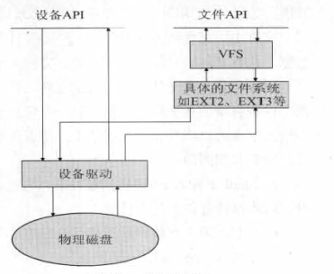
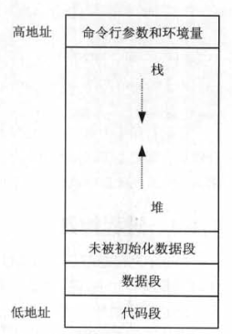

#概述

​		所有操作系统都向系统中运行的程序提供服务。典型的服务有执行新程序、打开文件、读写文件、分配内存、获取当前时间等。Linux 下的系统编程是指程序员使用系统调用或 C 语言本身所携带的库函数来设计和编写具有某一特定功能的程序。shell 命令是操作系统提供给普通用户使用的接口，而系统调用是操作系统提供给程序员使用的接口，如作为系统调用提供的 open 函数用于打开一个文件。实际上，C 语言的函数库也是通过系统调用来实现的，它封装了系统调用，并在此基础上为方便程序员使用而增加了一些功能。Linux 为上层应用程序的开发提供了丰富的系统调用，应用程序只需包含相应的头文件就可以使用这些函数。实际上，这些系统调用都是以函数库的方式提供的。编译程序时，gcc 会自动链接一些常用的库，比如 libc.so.6。对于 gcc 不会自动链接的库，则在编译程序时需要指定所使用的库（编译程序时使用 -l<库名> -L<库所在的目录> 选项）。

​		在编写程序时，有时可能会忘记参数的个数、参数的顺序、函数所在的头文件等信息，只记得函数的大概形式（如函数名）。这时可以通过在 Shell 命令行下输入 man 命令来查看函数原型。例如输入man lseek 就可以获取 Iseek 函数的原型和所属头文件。有些函数名如 mkdir 既是 Linux 的命令，也是系统调用，这时可以通过输入 man 2 mkdir 获取该函数的原型，只输入 man mkdir 得到的是命令mkdir的帮助信息。对于库函数，输入 man 3 <库函数名> 可以获得帮助信息，例如 man 3 opendir。

##文件操作

###Linux 文件结构

​		Linux 是一个安全的操作系统，它是以文件为基础而设计的。Linux 的文件子系统主要用于管理文件存储空间的分配、文件访问权限的维护、对文件的各种操作。用户可以使用命令对文件进行操作，但在功能上受到一定的限制。程序员可以通过系统调用或 C 语言的库函数对文件进行操作。文件主要包含两方面的内容：一是文件本身所包含的数据；另外就是文件的属性，也称为元数据，包括文件访问权限、所有者、文件大小、创建日期等。

​		目录也是一种文件，称为目录文件。目录文件的内容是该目录的目录项，目录项是该目录下的文件和目录的相关信息。当创建一个新目录时，系统将自动创建两个目录项：`.` 和 `..`，在 Shell 下输入 la -a 可以将其显示在终端上，前者代表当前目录，后者代表当前目录的父目录。对于根目录，两者是相同的。

​		一般的 Linux 发行版本都包含如下目录

- /bin 用于存放普通用户可执行的命令，系统中的任何用户都可以执行该目录中的命令，如 ls、cp、mkdir等命令。
- /boot Linux 的内核及启动系统时所需要的文件，为保证启动文件更加安全可靠，通常把该目录存放在独立的分区上。
- /dev 设备文件的存储目录，如硬盘、光驱等。
- /etc 用于存放系统的配置文件，比如用户账号及密码存放在配置文件 /etc/password  和 /etc/shadow 中
- /home 普通用户的主目录，每个用户在该目录下都有一个与用户同名的目录。
- /lib 用于存放各种库文件。
- /proc 该目录是一个虚拟文件系统，只有在系统运行时才存在。通过访问该目录下的文件，可以获取系统的状态信息并且修改某些系统的配置信息，可以简单地使用 cat、strings 命令来查看这些信息，如在 Shell 下输入 cat /proc/meminfo 可以获取系统内存的使用情况，输入 man proc 可获得关于 proc 详细的信息。
- /root 超级用户 root 的主目录。
- /sbin 存放的是用于管理系统的命令。
- /tmp 临时文件目录。
- /usr 用于存放系统应用程序及相关文件，如说明文档、帮助文件等。
- /var 用于存放系统中经常变化的文件，如日志文件，用户邮件等。

###Linux 文件系统模型

​		数据或者说文件归根结底是要存储在物理磁盘上的，操作系统通过文件系统可以方便地对磁盘上的文件进行管理。Linux 的文件系统模型如下图所示。

对物理磁盘的访问都是通过设备驱动程序来进行的，而对设备驱动的访问则有两种途径:一种是通过设备驱动本身提供的接口；另一种是通过虚拟文件系统（Virtual File System，VFS）提供给上层应用程序的接口。第一种方式能够让用户进程绕过文件系统直接读写磁盘上的内容，这给操作系统带来了很大的不稳定性，因此大部分操作系统包括 Linux 都是使用虚拟文件系统来访问设备驱动的。只有在特殊情况下才允许用户进程通过设备驱动接口直接访问物理磁盘

​		VFS 是虚拟的，不存在的，它和前面提到的 proc 文件系统一样，都是只存在于内存而不存在于磁盘之中的，即只有在系统运行起来以后才存在。VFS 提供一种机制，将各种不同的文件系统整合在一起，并提供统一的应用程序编程接口（API）供上层的应用程序使用。VFS 的使用体现了 Linux 文件系统最大的特点——支持多种不同的文件系统。

​		从硬盘的构造可知，每次对物理磁盘的访问的最小单位是一个盘面上的一个磁道上的一个扇区，即使用户只需要访问 1 个字节的数据，实际读写时都是先把该字节所在的扇区读入到内存，然后再进行访问。正因为如此，文件系统是由一系列块（block）构成的，每个块的大小因不同的文件系统而不同，但是一个文件系统一旦安装之后，块的大小就固定了。通常一个块的大小是一个扇区的大小，而一个扇区通常为 512 字节

###文件的分类

​		Linux 中包含以下几种文件类型

- 普通文件（regular file）：这是最常见的文件类型，这种文件包含了某种形式的数据。至于这种数据是文本还是二进制数据，对于内核而言并无区别。对普通文件内容的解释由处理该文件的应用程序完成。
- 目录文件（directory file）：目录文件就是目录，目录也有访问权限，目录文件的内容就是该目录下的文件和子目录的信息，对一个目录文件具有读许可权的任一进程都可以读该目录的内容，但只有内核可以写目录文件。
- 字符特殊文件（character special file）：用于表示系统中字符类型的设备，比如键盘、鼠标等，这些硬件对操作系统来说只是一个文件。
- 块特殊文件（block special file）：用于表示系统中块类型的设备，如硬盘、光驱等。对这些设备上的数据的访问通常以块的方式进行，即一次至少读写一个块。
- FIFO：这种类型文件用于进程间的通信，也称为命名管道。
- 套接字（socket）：主要用于网络通信，套接字也可以用于一台主机上的进程之间的通信。
- 符号连接（symbolic link）：指向另一个文件，是另一文件的引用。

Shell 下通过 ls -l 可以查看文件类型。

###文件的访问权限控制

​		对文件访问控制的修改在 Shell 下可通过 chmod 进行。详细用法参考 man chmod。进行程序设计时，可以通过 chmod/fchmod 函数对文件访问权限进行修改。在 Shell 下输入 man 2 chmod 可查看函数原型，两者的区别在于 chmod 以文件名作为第一个参数，fchmod 以文件描述符作为第一个参数。

##文件的输入输出

###文件的创建、打开与关闭

- open 函数
- creat 函数
- close 函数

###文件的读写

- read 函数
- write 函数

###文件读写指针的移动

- lseek 函数

###dup、dup2、fcntl、ioctl 系统调用

##文件属性操作

###获取文件属性

- stat 函数
- fstat 函数
- lstat 函数

###设置文件属性

- chmod 函数
- fchmod 函数
- chown 函数
- fchown 函数
- lchown 函数
- truncate 函数
- ftruncate 函数
- utime 函数
- umask 函数

##文件的删除和移动

###文件的移动

- rename 函数

###文件的删除

- remove 函数

##目录操作

###目录的创建和删除

- mkdir 函数
- rmdir 函数

###获取当前目录

- getcwd 函数

###设置工作目录

- chdir 函数
- fchdir 函数

###获取目录信息

- opendir 函数
- readdir 函数
- closedir 函数

#进程控制

##概述

​		Linux 是一个多用户多任务的操作系统。多用户是指多个用户可以在同一时间使用计算机；多任务是指 Linux 可以同时执行几个任务，可以在还未执行完一个任务时又执行另一个任务。进程简单地讲就是运行中的程序，Linux 系统的一个重要特点是可以同时启动多个进程。根据操作系统的定义：进程是操作系统资源管理的最小单位。

​		进程是一个动态的实体，是程序的一次执行过程。进程是操作系统资源分配的基本单位。要掌握进程的概念就要将其与程序、线程两个概念区别开。进程和程序的区别在于进程是动态的，程序是静态的;进程是运行中的程序，程序是一些保存在硬盘上的可执行的代码。为了让计算机在同一时间内能执行更多任务，在进程内部又划分了许多线程。线程在进程内部，它是比进程更小的能独立运行的基本单位。线程基本上不拥有系统资源，它与同属一个进程的其他线程共享进程拥有的全部资源。进程在执行过程中拥有独立的内存单元，其内部的线程共享这些内存。一个线程可以创建和撤销另一个线程，同一个进程中的多个线程可以并行执行。

​		Linux 下可通过命令 ps 或 pstree 查看当前系统中的进程。

​		**进程标识**：Linux 操作系统中，每个进程都是通过唯一的进程 ID 标识的。进程 ID 是一个非负数，每个进程除了进程 ID 外还有一些其他标识信息。都可以通过相应的函数获得，这些函数声明在 unistd.h 头文件中

| 函数声明          | 功能                  |
| ----------------- | --------------------- |
| pid_t getpid(id)  | 获得进程 ID           |
| pid_t getppid(id) | 获得进程父进程的 ID   |
| pid_t getiid(id)  | 获得进程的实际用户 ID |
| pid_t geteuid(id) | 获得进程的有效用户 ID |
| pid_t getgid(id)  | 获得进程的实际组 ID   |
| pid_t getegid(id) | 获得进程的有效组 ID   |

- 实际用户ID（uid）：标识运行该进程的用户。
- 有效用户ID（euid）：标识以什么用户身份来运行进程。例如，某个普通用户A，运行了一个程序，而这个程序是以root身份来运行的，这程序运行时就具有root权限。此时实际用户ID是A用户的ID，而有效用户ID是root用户ID。
- 实际组ID（gid）：它是实际用户所属的组的组ID。
- 有效组ID（egid）：有效组ID是有效用户所属的组的组ID。

​		**Linux 进程的结构**：代码段、数据段和堆栈段。代码段存放程序的可执行代码。数据段存放程序的全局变量、常量、静态变量。堆栈段在中的堆用于存放动态分配的内存变量；堆栈段中的栈用于函数调用，存放函数的参数、函数内部定义的局部变量。

​		**Linux 进程状态**：

###进程控制

- fork
- exit
- exec
- wait
- getpid
- nice

###进程的内存映像

####Linux 下程序转化成进程

​		Linux 下 C 程序的生成分为四个阶段：预编译、编译、汇编、链接。当程序执行时，操作系统将可执行程序复制到内存中。程序转化为进程通常需要经过以下步骤

1. 内核将程序读入内存，为程序分配内存空间
2. 内核为该进程分配进程标识符（PID）和其他所需资源
3. 内核为该进程保存 PID 及相应的状态信息，把进程放到运行队列中等待执行。程序转化为进程后就可以被操作系统的调度程序调度执行了

####进程的内存映像

​		进程的内存映像是指内核在内存中如何存放可执行程序文件。在将程序转化为进程的过程中，操作系统将可执行程序由硬盘复制到内存中。

​		Linux 下程序映像的一般布局如下图

- 代码段：即二进制机器代码，代码段是只读的，可被多个进程共享。如一个进程创建了一个子进程，父子进程共享代码段，此外子进程还获得费用进程的数据段、堆、栈的复制
- 数据段：存储已被初始化的变量，包括全局变量和已被初始化的静态变量
- 未初始化数据段：存储未被初始化的静态变量，也被称为 bss 段
- 堆：用于存放程序运行中动态分配的变量
- 栈：用于函数调用，保存函数的返回地址、函数的参数、函数内部定义的局部变量

另外，高地址还存储了命令行参数和环境变量

​		可执行程序和内存映像的区别在于:可执行程序位于磁盘中而内存映像位于内存中;可执行程序没有堆栈，因为程序被加载到内存中才会分配堆栈:可执行程序虽然也有未初始化数据段但它并不被储存在位于硬盘中的可执行文件中;可执行程序是静态的、不变的，而内存映像随着程序的执行是在动态变化的，例如，数据段随着程序的执行要存储新的变量值，栈在函数调用时也是不断在变化中。

##进程操作

###创建进程

- fork 函数
- 孤儿进程
- vfork 函数
- 创建守护进程

###进程退出

- exit 函数
- about 函数

#线程控制

pthread

锁

#信号和处理

##介绍

​		信号（signal）是一种软件中断，它提供了一种处理异步事件的方法，也是进程间惟一的异步通信方式。在 Linux 系统中，根据 POSIX 标准扩展以后的信号机制，不仅可以用来通知某进程发生了什么事件，还可以给进程传递数据。

###信号来源

​		信号来源可以有很多种方式，按照产生条件的不同可分为硬件和软件两种方式

###信号种类

​		Shell 下输入 kill -l 可以显示 Linux 系统支持的全部信号。信号的值在 signal.h 中定义

- 可靠信号与不可靠信号
- 信号的优先级

###进程对信号的响应

​		当信号发生时，用户可以要求进程以下列3种方式之一对信号做出响应。

- 捕捉信号。对于要捕捉的信号，可以为其指定信号处理函数，信号发生时该函数自动被调用，在该函数内部实现对该信号的处理。
- 忽略信号。大多数信号都可使用这种方式进行处理，但是SIGKILL和 SIGSTOP这两个信号不能被忽略，同时这两个信号也不能被捕获和阻塞。此外，如果忽略某些由硬件异常产生的信号（如非法存储访问或除以0），则进程的行为是不可预测的。
- 按照系统默认方式处理。大部分信号的默认操作是终止进程，且所有的实时信号的默认动作都是终止进程。

##信号处理

###信号的捕捉和处理

- signal 函数
- sigaction 函数

###信号处理函数的返回

- setjmp 函数
- longjmp 函数
- sigsetjmp 函数
- siglongjmp 函数

###信号发送

- kill 函数
- raise 函数
- sigqueue 函数
- alarm 函数
- getitimer 函数
- setitimer 函数
- abort 函数

###信号的屏蔽

- sigprocmask 函数
- sigpending 函数
- sigsuspend 函数

#进程间通信

##概述

​		Linux 下进程间通信的方法基本上是从UNIX平台继承而来的。Linux 操作系统不但继承了 system V IPC通信机制，还继承了基于套接字（socket）的进程间通信机制。前者是贝尔实验室对 UNIX 早期的进程间通信手段的改进和扩充，其通信的进程局限于单台计算机内；后者则突破了这一局限，通信的进程可以运行在不同主机上，也就是进行网络通信。

​		下面对 Linux 下进程间通信的几种主要手段作一个简单的介绍。

- **管道（pipe）**
- **有名管道（named pipe）**
- **信号量（semophore）**
- **消息队列（message queue）**
- **信号（signal）**
- **共享内存（shared memory）**
- **套接字（socket）**

